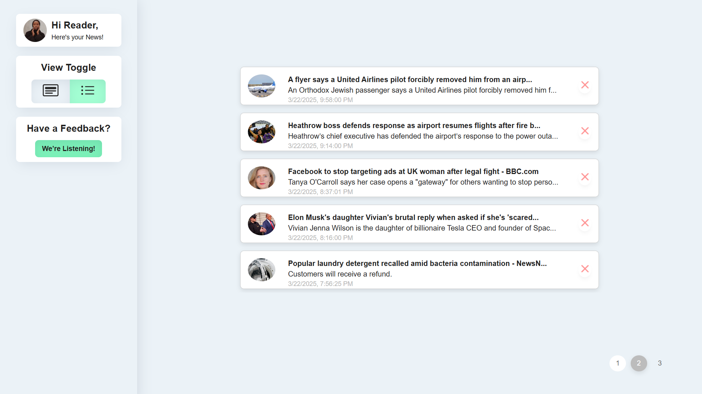
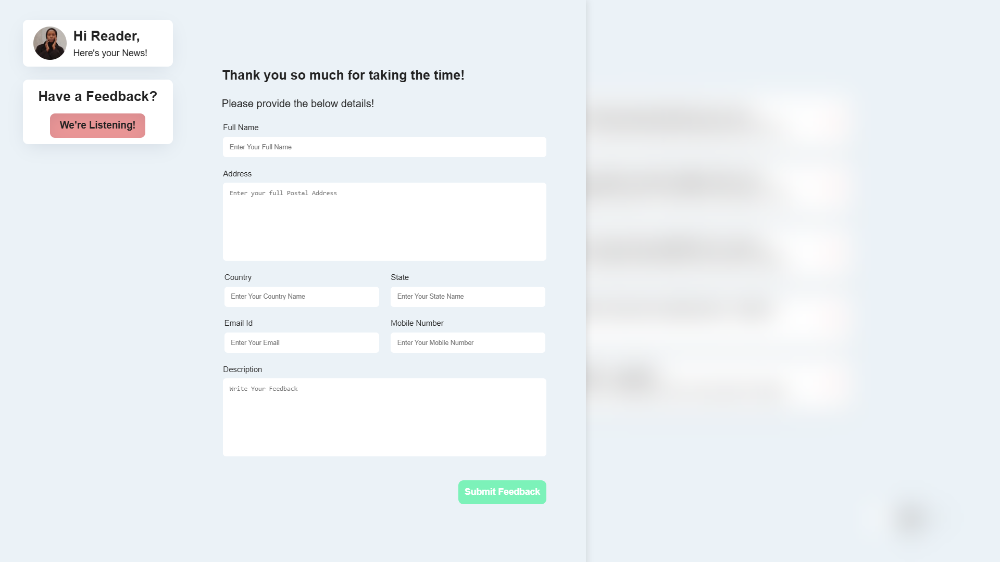
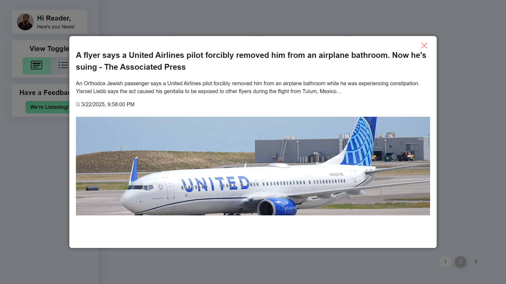
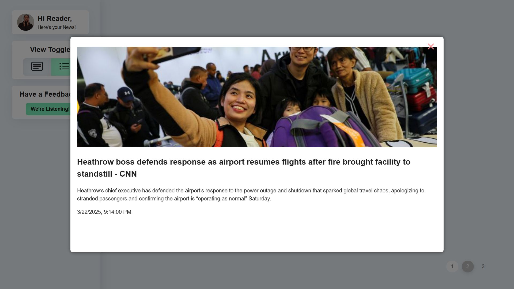

# 📰 News App  

## 🚀 Overview  
The **News App** is a modern, fully responsive **Single Page Application (SPA)** built with **React.js**. It fetches the latest news from an API using **Axios**, displaying them in an elegant **Group View** and **List View**. The app features interactive **buttons**, a **popup modal** for full article previews, and is styled with **CSS** for a sleek UI/UX.  

---

## 🎯 Features  
✅ **Fetch Real-Time News** – Uses **Axios** to fetch and display live news updates.  
✅ **Multiple Views** – Switch between **Group View** and **List View** for better readability.  
✅ **Popup Modal** – Click on a news card to view full details in a **70% x 70%** popup.  
✅ **React Hooks** – Utilizes **useState, useEffect**, and **useRef** for state management.  
✅ **SPA Navigation** – Fully functional **Single Page Application** with smooth interactions.  
✅ **Reusable Components** – Modular **Button**, **Card**, and **Popup** components for scalability.  
✅ **CSS Styling** – Clean and modern UI using **CSS** with hover effects and animations.  

---

## 🛠️ Technologies Used  
🔹 **React.js** – Core frontend framework  
🔹 **Axios** – API fetching for real-time news  
🔹 **CSS** – Styling and responsiveness  
🔹 **JavaScript (ES6+)** – Logic and component interactions  
🔹 **React Hooks** – State and lifecycle management  
🔹 **Popup Modal** – Custom popups for detailed news view  

---

## 🖥️ Installation & Setup  
### 1️⃣ Clone the Repository  
```bash
git clone https://github.com/Chandramouli2022/newsify.git
cd news-app
```

### 2️⃣ Install Dependencies  
```bash
npm install
```

### 3️⃣ Start the Development Server  
```bash
npm start
```
The app will run on **http://localhost:3000/**  

---

## 📌 How It Works  
1️⃣ **Fetches the latest news** via **Axios** on page load.  
2️⃣ **Displays news articles** in either **Group View (Grid)** or **List View**.  
3️⃣ **Click on a news card** to open a **popup modal** with the full details.  
4️⃣ **Close the popup** to return to the main view.  
5️⃣ **Switch views** dynamically between Group and List layouts.  

---

## 🏗️ Project Structure  
```

## 📷 Screenshots  
🔹 **Group View (Grid Layout)**  
![Group View]

🔹 **List View**  
![List View]

🔹 **Feed Back**


🔹 **Popup Modals both**  
![Popup Modal]



---

## 🎯 Future Improvements  
🚀 **Dark Mode** – Toggle between light and dark themes.  
🚀 **Search Functionality** – Find articles by keyword.  
🚀 **Bookmark System** – Save articles for later reading.  
🚀 **Category Filters** – Browse news by category (Tech, Sports, etc.).  

---

## 🤝 Contributing  
We welcome contributions! Feel free to submit issues or pull requests.  
---

### 🌟 Made with ❤️ using React, Axios, and CSS! 🚀